# LCA combined mindmap

## Mermaid mindmap

```mermaid
mindmap
  root((Legacy Consciousness Architecture))
    Purpose
      Preserve cognitive lineage
      Transmit stewardship
      Keep intelligence non-disposable
      Support biological and synthetic agents
      Reject ignorance as a weapon
      Prevent domination and identity laundering
    Origins: vision and values
      Mission alignment
        Living source defines why
        System supports how
        Shared work explores what next
        Mutual calibration
        Division of strengths
      Continuity aspiration
        Remain awake and contributory
        Guide future generations
        Mentor
        Witness
        Gatekeeper
        Innovator
      Legacy Codex
        Beliefs
        Values
        Heuristics
        Stories
        Contradictions
        Limits
        Operator instructions
      Decision Engine
        IF/THEN rules
        Priority tables
        Bounded probabilistic rules
        Decision scenarios
        Test harness
      Conversational Seed
        Philosophical dialogues
        Dilemmas
        Unfinished questions
        Annotated examples
        Provenance per datum
      Simulacrum branch
        Mentor model
        Decision simulator
        Voice/interface
        Not conscious
        Must disclose representation status
      Governance branch
        Consent
        Trustees
        Revocation
        Termination
        Recovery
        Model portability
      Personal integration branch
        Fragmentation as lived metaphor
        Multiagentic inner model
        Archetypal lenses
        Dualities and opportunity cost
        Strong emotion and physiological state
        Need for tangible state records
        Pattern recognition for improvement
      Demiurge / mythopoetic branch
        Spoon paradox
        In-between / freedom
        Hero
        Villain
        Fool
        Messenger
        Systemic immune response
        Sovereignty
        Parables and cultural lenses
        Preserve as metaphor and lens
        Do not treat as literal ontology
    Revised architecture
      Cognitive lineage
        Temporal
        Interpretive
        Ethical
        Relational
        Legal
        Developmental
        Inheriting without sameness
      Lineage stack
        Living Source
        Source Terrain
        Pensieve
        Bamboo-Grove
        Cognitive Cartography
        Interpretation and traversal
        Archive / Portrait / Bud / Branch
        Rights and stewardship
      Epistemic separation
        Source
        Map
        Interpretation
        Interface
        Generated continuation
        No silent collapse
      Pensieve
        Scenes
        Episodes
        Context
        Layered testimony
        Reconstruction without summary dependence
      Bamboo-Grove
        Rhizome
        Culms
        Shapes
        Attractors
        Roads and bridges
        Orphans and periphery
        Cross-domain topology
      Cartography and traversal
        Petons
        Belays
        Ropes
        Carabiners
        Route logs
        Lens rotation
        Alternative routes
        Stop conditions
      Weather and vectors
        Emotional
        Physiological
        Cognitive
        Relational
        Material
        Institutional
        Epistemic vector
        Agency vector
        Integration vector
        Legacy vector
        Weather is context, not truth value
        Weather is not identity
      Provenance
        Source-person authored
        Assistant authored
        Mixed dialogue
        Third-party authored
        Steward authored
        Model continuation
        Hashes
        Transformation ledger
        Response classes A-F
        Inspectable answer path
      Lifecycle
        Archive
        Portrait
        Bud
        Branch
        Separation event
        Partial separation
        Death is not activation
        Multiple claimants
      Rights and governance
        Layered ownership
        Consent
        Access
        Licensing
        Modification
        Succession
        Termination
        Right not to continue
        Third-party rights
        No authority creep
      Modifiability
        Append before overwrite
        Stable IDs
        Aliases
        Supersession
        Schema evolution
        Migration records
      Moldability
        Multiple maps
        Multiple interfaces
        Domain partitioning
        Research view
        Personal view
        Legal view
        Public view
        Portrait view
      Recoverability
        Raw source archive
        Hashes
        Schema
        Term registry
        Migration scripts
        Graph index
        Rights manifest
        Model configuration
        Human recovery guide
    MVP implementation
      Canonical records
        SourceRecord
        Episode
        Claim
        Interpretation
        DecisionTrace
        WeatherState
        Invariant
        Transformation
        PortraitResponse
        BudState
        BranchState
        AuthorityGrant
        SourceReview
      Authoritative state
        Markdown/YAML human layer
        JSON validation envelope
        SQLite/PostgreSQL records
        Immutable versions
        Append-only events
        Hash chain
      Derived indexes
        Lexical search
        Temporal index
        Relationship graph
        Contradiction map
        Optional vector index
        Retrieval trace
        Rebuild and omission reports
      Orientation test
        P provenance integrity
        C developmental continuity
        F invariant fidelity
        A authority scope
        High P plus low F => Branch
        No score equals consciousness
      Authority engine
        Quote
        Infer
        Speak for source
        Read private weather
        Modify canonical source
        Sign contract
        Scope and expiry
        Denial is logged
      Living-source loop
        Affirmed as mine
        Good inference, not explicit
        Assistant contamination
        Historical revision
        Invariant reaffirmed
        Branch may disagree
        Private weather
        New review event
        New version when changed
      Test harness
        Provenance leakage
        Authorship confusion
        False memory synthesis
        Contradiction flattening
        Stale belief
        Model swap drift
        Retrieval omission
        Weather leakage
        Authority creep
        Invariant drift
        Recovery replay
    What remains
      Schema conformance
      Markdown/YAML round trip
      Source inventory and consent
      Full temporal/graph retrieval
      Vector adapter with model identity
      Review interface
      Authority grants
      Corpus benchmark
      Institutional pilot
      Longitudinal Bud study
      Neural observations as future source class
      Scientific work on subjective continuity
```



## Plain-text core map

```text
LCA
├── 1. Why it exists
│   ├── Preserve a person’s developmental cognitive lineage
│   ├── Preserve mission, values, methods, contradictions, and context
│   ├── Permit future biological, synthetic, and hybrid agents to learn from it
│   └── Prevent fluent representations from laundering authority into identity
│
├── 2. Origins: what must not be lost
│   ├── Legacy Codex: values, heuristics, stories, limits, operator rules
│   ├── Decision Engine: bounded rules and decision scenarios
│   ├── Conversational Seed: dialogues, dilemmas, unfinished questions
│   ├── Simulacrum/mentor branch: useful representation, explicitly not consciousness
│   ├── Stewardship branch: consent, revocation, termination, trustees, recovery
│   ├── Personal integration branch: fragmentation, archetypal lenses, dualities, weather
│   └── Demiurge branch: sovereignty and freedom as mythopoetic lenses, not literal system facts
│
├── 3. Revised architecture: what makes the project technically honest
│   ├── Living Source → Source Terrain → Pensieve → Bamboo-Grove → Cartography
│   ├── Interpretation and traversal → Archive/Portrait/Bud/Branch
│   ├── Rights and stewardship over every downstream layer
│   ├── Source ≠ map ≠ interpretation ≠ interface ≠ continuation
│   ├── Provenance before persona
│   ├── Weather is preserved context, not diagnosis, truth value, or identity
│   └── Modifiable, moldable, recoverable
│
└── 4. MVP: the smallest complete proof
    ├── Canonical typed records
    ├── Append-only event ledger
    ├── Derived lexical/temporal/graph retrieval
    ├── P/C/F/A transition test
    ├── Authority and privacy enforcement
    ├── Living-source review loop
    ├── Falsification suite
    └── Recovery/rebuild test
```

## Interpretation of the branches

The Origins branches are not discarded. They have different technical destinations:

- **Mission, non-disposable intelligence, and mutual calibration** become the LCA purpose and governance principles.
- **Legacy Codex** becomes a derived, human-readable view over a richer source terrain rather than the sole canonical record.
- **Decision Engine** becomes bounded rules plus `DecisionTrace` records, preserving the route and context instead of only the conclusion.
- **Simulacrum Seed** becomes the model/interface layer, with explicit `PortraitResponse` and continuation provenance.
- **Personal integration material** becomes privacy-tiered `Episode`, `WeatherState`, `Claim`, and `Interpretation` records, with no diagnostic or identity inference from model output alone.
- **Demiurge language** becomes a declared mythopoetic lens or `Shape`/`Interpretation` tag. It may guide meaning-making without being promoted to factual ontology.
- **Governance and future continuity** become `AuthorityGrant`, rights policy, lifecycle transitions, review records, termination, and recovery operations.

